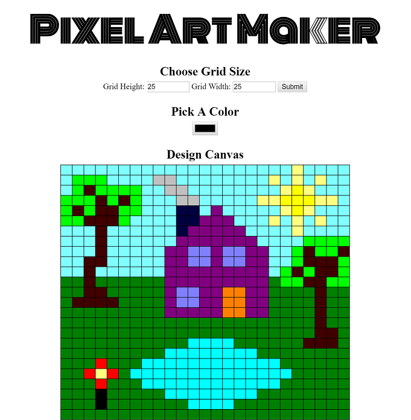
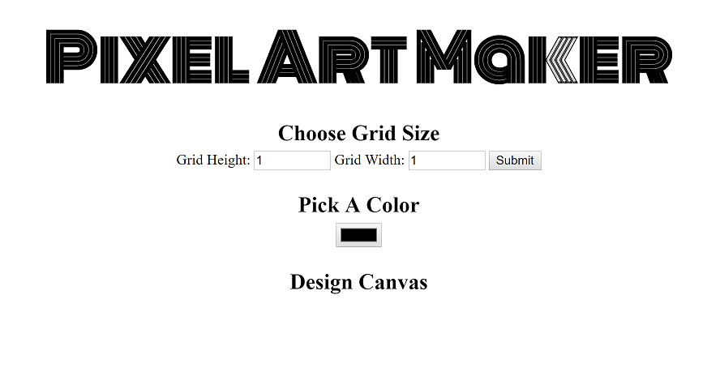
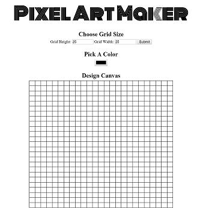
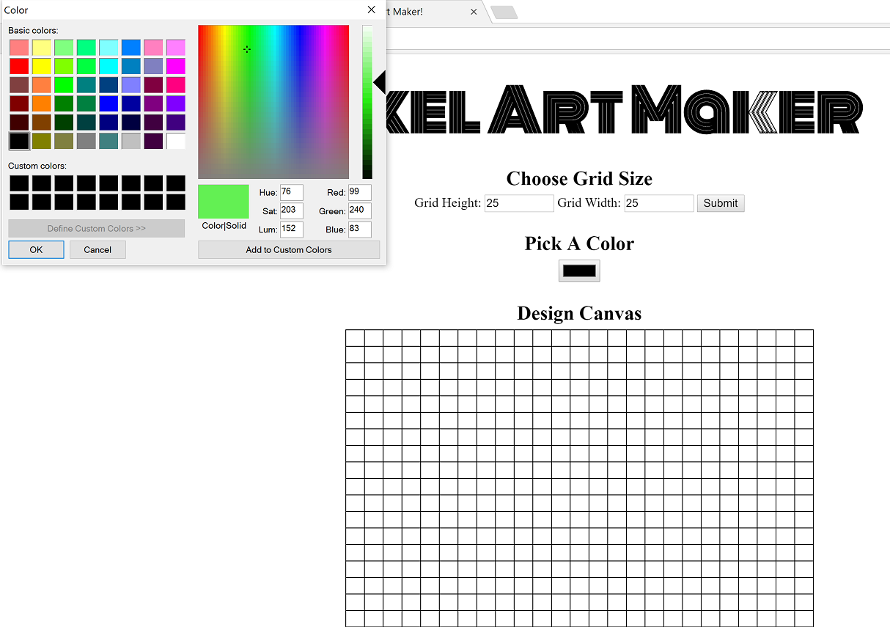
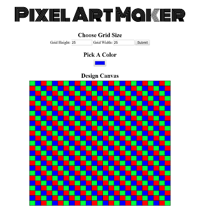
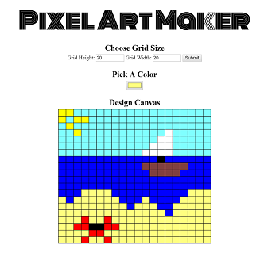

# Pixel Art Maker

<p align="center">
  
</p>

### Running The Application
The application can be run in your browser by clicking [here](https://wbchristerson.github.io/pixel-art/). To download, you can clone the repository using this terminal command:
```
git clone https://github.com/wbchristerson/pixel-art.git
```

Alternatively, follow the instructions below to download to a hard drive:
* Click the green "Clone or download" button above then choose "Download ZIP".
* Find the folder `pixel-art-master` in your Downloads folder or wherever it was placed on your device.
* Right click and choose "Extract All".
* Open your browser and use `Ctrl + O` (for Windows machines) to open the file selector on your device.
* Go to `pixel-art-master`, enter `pixel-art-master` again, then select `index.html`. The game screen will appear.

### Structure
* The user can choose the dimensions of the pixel grid to each be anything from 1 to 50.
* Upon submitting the grid dimensions, the grid is created and the user can choose various colors for the individual pixels.

### Design
* The application is a single page which begins with no shown grid and a default color of black.

<p align="center">
  
</p>

* The dimensions of the grid are determined by an input element, to call an error when the inputs are not numerical values (integers) between 1 and 50.
* Submitting the dimension values produces a blank grid below the text.

<p align="center">
  
</p>

* By clicking on the color option, a window appears which shows the various colors that can be generated.

<p align="center">
  
</p>

* Color the grid by clicking on individual pixels.

<p align="center">
  
  
</p>

### Acknowledgments

This project is based on a skeleton structure from Udacity. For more information, see the initial commit for this repository.

### Remaining Issues
* When the mouse remains clicked down and is moved around, the intermediate pixels are not colored, making it time-consuming to color entire regions of pixels in the same color. I could try to use the hover pseudo-class somehow for this, but have not considered this in detail.
* It would be nice if there were a way for the user to save his/her design without having to resort to taking a screen shot and then cropping the image in a photograph editor.
